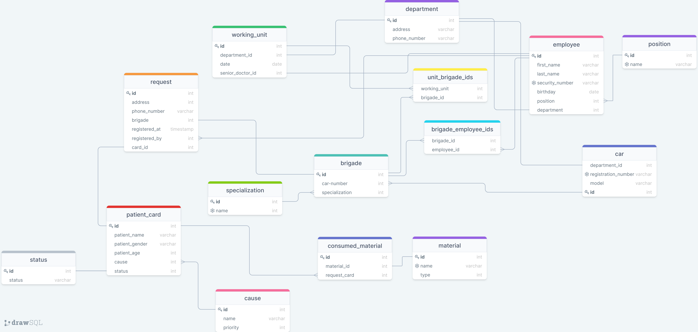

# OpenHeart

## A goal to achieve:

Let's suppose we have a medical station, and we need to manage its several
busyness processes. This application particularly simplifies registration process, including picking
medical brigades, orderings and prioritizing requests, monitoring request statuses,
used resources and keeping the statistics. This DB schema is used for an application to automatize medical station work.

## Schema

## Documentation

| Table name     | Description                                                                                                                                                                                                              |
|----------------|--------------------------------------------------------------------------------------------------------------------------------------------------------------------------------------------------------------------------|
| Department     | Just a list of available medical stations                                                                                                                                                                                |
| Employee       | A comprehensive list of employees who have a particular job (drivers, paramedics, doctors, operators, etc)                                                                                                               |
| Brigade        | Daily working unit that contains two paramedics, driver and describes car info and unit specialization                                                                                                                   |
| Request        | Kind of end-user's order to request a medical brigade to get some help (injury, decease, etc)                                                                                                                            |
| Request Card   | Normally, it is just an electronic version of real card created by paramedic as a result of request handling. It contains information about patient, real severity of request, any information about provided assistance |
| Causes         | A list of symptoms and possible diagnosis with severities                                                                                                                                                                |
| Materials      | A list of pharmaceutical products that can be used during assistance. It contains information about restricted and limited products.                                                                                     | 
| Used Materials | A list for monitoring overall and periodic consumptions of materials by brigades.                                                                                                                                        | 
| Schedule       | History table to monitor and check how many brigades are on current date and  where they work.                                                                                                                           | 
 

---

Pet project for RDBMS lessons at OTUS company
